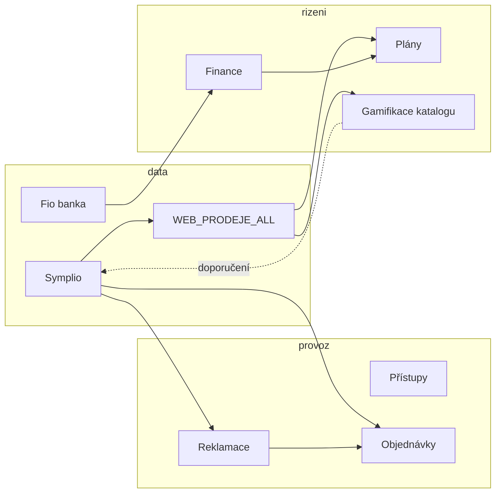

# Roadmap budoucích funkcí MOBILMAJAK

Živý dokument pro plánování rozšíření. U každé oblasti: **stav dnes**, **varianty rozpracování**, **odhad náročnosti** (S/M/L/XL) a **vliv na kvalitu aplikace** (1–5, kde 5 = největší přínos pro provoz nebo řízení firmy).

Poslední revize: 2026-08-18 (§20 servis na všech prodejnách + výpomoc zaměstnanců)

---

## Jak číst tabulky

| Symbol | Význam |
|--------|--------|
| **S** | řádově dny |
| **M** | 1–2 týdny |
| **L** | 3–6 týdnů |
| **XL** | větší projekt, více modulů / integrací |

**Vliv** = kombinace užitku pro provoz, spolehlivost dat, adopce týmem a snížení ruční práce.

---

## 1. Modul Finance

### Stav dnes

- Backend: `finance` app — modely `NakladPolozka`, `NakladKategorie`, `FioKategorizacniPravidlo`, audit log.
- API: fronta nezařazených, ruční náklad, kategorie; Fio import připraven (`import_fio_naklady`), defaultně **vypnutý** (`FINANCE_FIO_ENABLED=0`).
- Frontend: `FinanceModule` — záložky „K zařazení“ + „Ruční náklad“, za feature flagem.
- Packeta provize: import v analytice (Zásilkovna), ne v modulu Finance.
- Secrets šablona: `config/secrets-examples/mobilmajak-finance.example.json` (Fio, Packeta admin, Google Sheets náklady).

### Varianty

| Varianta | Popis | Náročnost | Vliv | Poznámka |
|----------|-------|-----------|------|----------|
| **F1 – Minimální produkce** | Zapnout Fio cron + fronta zařazování + pravidla v admin UI | M | 4 | Nejrychlejší ROI; vyžaduje Fio token a `FINANCE_FIO_ENABLED=1` |
| **F2 – Přehled nákladů** | Měsíční/roční dashboard: náklady per kategorie, per prodejna, porovnání s obratem z plánů | L | 5 | Propojí finance s existujícími plány — řízení marže |
| **F3 – Google Sheets sync** | Import/merge z tabulek dle `google_sheets` v secrets (historické náklady) | M | 3 | Jednorázový bootstrap + občasný sync |
| **F4 – Pravidla + auto-zařazení** | UI pro `FioKategorizacniPravidlo`, návrh pravidel z opakovaných zařazení | M | 4 | Stejný pattern jako u katalogové gamifikace (viz §7) |
| **F5 – P&L / cashflow** | Tržby (WEB_PRODEJE_ALL) − náklady − fixní náklady prodejen → jednoduchý výsledek | XL | 5 | Strategické řízení; závisí na kvalitě zařazení (F1–F4) |
| **F6 – Packeta v Finance** | Sjednotit provize Packeta do finance modulu (dnes analytika) | S | 2 | Čistší UX, nižší priorita než Fio |

### Doporučené pořadí

1. **F1** (Fio + fronta)  
2. **F4** (pravidla)  
3. **F2** (přehled)  
4. **F5** až když je zařazení spolehlivé  

### Rizika

- Špatně zařazené náklady = špatná rozhodnutí (F5). Nejdřív kvalita vstupu, pak agregace.
- Fio token na firemním účtu — právní/účetní odsouhlasení.

---

## 2. Import všech hesel (modul Přístupy)

### Stav dnes

- Modul **Přístupy** (`/access`): CRUD přes `web_pristupy` → tabulka `WEB_PRISTUPY_PRODEJNY`.
- Existuje migrační command `migrate_company_access` ze staré tabulky `active_company_access`.
- Hesla v DB jako plaintext (záměr pro rychlé kopírování na prodejně) — zvážit šifrování at-rest v budoucnu.

### Varianty

| Varianta | Popis | Náročnost | Vliv | Poznámka |
|----------|-------|-----------|------|----------|
| **P1 – Jednorázový import** | Spustit `migrate_company_access` na produkci (+ audit duplicit) | S | 4 | Pokud `active_company_access` stále obsahuje kompletní data |
| **P2 – Import z CSV/Excel** | Admin upload: sloupce firma, URL, login, heslo, prodejna, kategorie | S | 3 | Pro data mimo DB (KeePass export, tabulka) |
| **P2b – URL dodavatele z Mastersheet** | Při importu logins doplnit `website_url` (odkaz na e-shop / portál dodavatele) z názvu služby nebo mapy známých dodavatelů | S | 3 | Dnes import ukládá prázdné URL — viz §16 |
| **P3 – Sync z externího zdroje** | Pravidelný pull z Google Sheet / 1Password / Bitwarden API | L | 3 | Vyšší údržba; vhodné až po stabilizaci P1/P2 |
| **P4 – Centralizace + šablony** | Globální přístupy (všichni) vs per-prodejna; šablona „nová prodejna“ | M | 4 | Sníží chaos při otevírání poboček |
| **P5 – Audit a expirace** | `last_used`, upozornění na neaktivní / duplicitní účty, rotace hesel | M | 3 | Bezpečnostní hygiena |

### Doporučené pořadí

1. Ověřit obsah `active_company_access` vs `WEB_PRISTUPY_PRODEJNY` → **P1**  
2. Doplnit chybějící z tabulek → **P2**  
3. **P4** pro dlouhodobou správu  

### Otevřené otázky

- Kde dnes „žijí“ hesla, která v aplikaci ještě nejsou? (Symplio admin, dodavatelé, e-shopy, banky…)
- Má být heslo viditelné všem s modulem `access`, nebo jen admin + vedoucí prodejny?

---

## 3. Dokončení modulu Objednávky

### Stav dnes

- Kanban s **5 hlavními sloupci** (Nové | v košíku | objednáno | připraveno | vyřízeno) a hustými Excel-like řádky.
- Autofill: datum z `datum_vytvoreni`, zadal = přihlášený uživatel, prodejna ze směny / domovské.
- **MyRepair odkaz (live):** buňka Serviska → `https://workspace.myrepair.app/calendar/search.php?query=` + `servisni_cislo` (nová záložka).
- Model: zákazník, typ telefonu, díl, barva, dodavatel, servisní číslo, `prodejna`, Symplio ID.
- Backend analytics endpoint existuje (`analytics_data`), frontend ho zatím nevyužívá.

### Co „dokončit“ typicky znamená

| Varianta | Popis | Náročnost | Vliv | Poznámka |
|----------|-------|-----------|------|----------|
| **O1 – Notifikace** | Slack při nové objednávce + SLA připomínky (dlouho visící ve stavu); změna na „dorazilo čeká“ bez Slacku | M | 4 | Okamžitý provozní přínos |
| **O2 – Vazba na Symplio** | Pole `symplio_objednavka_id`, odkaz jako v `AuditZbytekPanel` | S | 3 | Konzistence s ostatními moduly |
| **O3 – SLA / eskalace** | Po X dnech ve stavu zvýraznit / eskalovat vedoucímu | M | 4 | Méně „zapomenutých“ dílů |
| **O4 – Admin analytika UI** | Grafy průměrné doby stavů (API už je) | S | 3 | Řízení servisního skladu |
| **O5 – Více dílů na objednávku** | Line items místo jednoho `dil` | M | 3 | Reálnější objednávky |
| **O6 – Dodavatel / objednávkový list** | Export pro MobilPohotovost, BP apod. | M | 4 | Snížení copy-paste |
| **O7 – Mobilní zjednodušený formulář** | Rychlé založení z telefonu na prodejně | M | 4 | Adopce prodejci |
| **O8 – Propojení s reklamacemi** | Objednávka dílu z reklamační evidence (viz §4) | L | 5 | Synergie modulů |
| **O9 – MyRepair deep-link** | Klik na servisku → workspace search | S | 4 | **Hotovo** (live v buňce Serviska) |

### Doporučené pořadí

**O1 → O2 → O3 → O4** (rychlé wins), pak **O6/O7** dle feedbacku týmu.

---

## 4. Evidence reklamací (díly)

### Stav dnes

- **Výdejky reklamace** se parsují ze Symplia (`sklad_vydejky_parse.py`, subtypy 202/252).
- V mzdách / payroll panelu: souhrn dobropisů + výdejek (ruční / spotřeba / reklamace).
- **Samostatný modul reklamací neexistuje** — žádná evidence stavu dílu, dodavatele, termínu vyřízení.

### Cíl

Evidence reklamací **dílů** (displej, baterie, kryt…): co šlo na reklamační sklad, u koho, v jakém stavu, kdy dorazila náhrada / uzavření.

### Varianty

| Varianta | Popis | Náročnost | Vliv | Poznámka |
|----------|-------|-----------|------|----------|
| **R1 – Import z převodek** | Sync výdejek typu reklamace (S-doklady) → fronta položek k doplnění | M | 5 | Využívá existující parser; minimální ruční zadávání |
| **R2 – Ruční založení** | Formulář: kód dílu, IMEI/servis, dodavatel, důvod, stav | S | 3 | Fallback když import nestačí |
| **R3 – Workflow stavů** | Nová → odesláno → přijato od dodavatele → vydáno zákazníkovi / storno | M | 5 | Kanban podobný objednávkám |
| **R4 – Vazba na objednávky** | Z reklamace jedním klikem založit objednávku chybějícího dílu | M | 4 | Propojení §3 + §4 |
| **R5 – Převodka na reklamační sklad** | Import nejen výdejek, ale i **příjemek / převodek** na reklamační sklad (pokud Symplio exportuje) | L | 4 | Upřesnit dostupný export z Symplia |
| **R6 – Report pro dodavatele** | Měsíční přehled: počet, hodnota, průměrná doba vyřízení | M | 4 | Vyjednávání podmínek |
| **R7 – Fotodokumentace** | Příloha poškození / čísla dílu | M | 3 | Spíš později |

### Navrhovaný datový model (hrubě)

```
ReklamacePolozka
  - kod, nazev, mnozstvi
  - zdroj_doklad (S…), datum_vydeje
  - prodejna_id, zalozil_user_id
  - dodavatel, cislo_reklamace_u_dodavatele
  - stav (enum)
  - symplio_objednavka_id (volitelně)
  - poznamka, uzavreno_datum
```

### Doporučené pořadí

**R1 + R2 + R3** jako MVP, pak **R4**, ověřit **R5** s reálným exportem z Symplia.

### Otevřené otázky

- Vedete reklamace hlavně z **výdejek**, nebo z **objednávek u dodavatele**?
- Má reklamační sklad vlastní skladovou kartu v Symplio, ze které jde číst zůstatek?

### Rozšíření z Mastersheet (2026-07-06)

Zdroj: listy `Servis Reklamace`, `Přerov/Šternberk/Čepkov Servis Reklamace` — dnes evidence v Excelu (naše značka R25xxx, dodavatel, faktura, EAN, datum odeslání, číslo zásilky).

| Varianta | Popis | Náročnost | Vliv |
|----------|-------|-----------|------|
| **R8 – Evidence odeslání** | Co kam šlo: dodavatel, zásilka, faktura, stav u partnera; náhrada za Excel listy | M | 5 |
| **R9 – Propojení finance / dobropisy** | Vazba reklamace ↔ dobropis (WEB_PRODEJE_ALL / payroll panel) ↔ případná náhrada od dodavatele | L | 5 | Až po R3 |
| **R10 – Import z Mastersheet** | Jednorázový bootstrap + šablona pro další importy | S | 3 |
| **R11 – Automatické připomínky** | Cron `check_reklamace_reminders`: tracking 2d (in-app), stav 10d (in-app), 30d (Slack); backend hotový, cron zatím jen staging | S | 4 | **Cíl: produkce do srpna 2026** – zapnout cron na produkci + ověřit notifikace s reálnými reklamacemi |

Doporučené pořadí po MVP: **R8** → **R9** → **R11** (až po R3 workflow stavů).

---

## 5. Gamifikace znalostí (katalog / kategorie)

> Poznámky z brainstormingu — zatím **neimplementováno**, vhodné jako samostatná fáze po stabilizaci provozních modulů.

### Kontext

- Pracovní Symplio kategorie (`Zakládání`, `Nově naskladněno`, …) → audit Zbytek (`AuditZbytekPanel`).
- Taxonomie v `category_mapping.py`.
- Žebříček bodů (`PointsLeaderboard`) — vzor pro motivaci.

### Varianty

| Varianta | Popis | Náročnost | Vliv | Poznámka |
|----------|-------|-----------|------|----------|
| **G1 – Kvíz** | „Kam patří?“ z historických správně zařazených položek; skóre přesnosti | M | 3 | Bez dopadu na produkci; měří znalosti |
| **G2 – Double-check fronta** | 2 hráči zařadí nezařazenou položku; shoda = doporučení adminovi | L | 4 | Crowdsourcing před Symplio |
| **G3 – Vážené hlasy** | Váha podle kvízové přesnosti v dané podkategorii | M | 3 | Až po G1+G2 |
| **G4 – Žebříček katalogářů** | Týdenní pořadí; body za konsenzus, ne za rychlost | S | 2 | Motivace; pozor na gaming |
| **G5 – Propojení s auditem** | V `AuditZbytekPanel` badge: doporučeno / spor / hotovo | M | 4 | Admin vidí výsledek hry |

### Doporučené pořadí

**G1** (ověření zájmu) → **G2 + G5** → **G3/G4**.

### Principy

- Hra **nedělá zápis do Symplio** — jen doporučení a metriky.
- Kvízové „správné“ odpovědi jen z položek stabilně mimo pracovní kategorie.
- Body za shodu dvou nezávislých hráčů.

---

## 6. Další rozšíření (návrhy)

| Nápad | Popis | Náročnost | Vliv | Priorita |
|-------|-------|-----------|------|----------|
| **Řízení marže po prodejně** | Obrat − náklady (finance) − mzdy (shifts) per prodejna | XL | 5 | Po F2/F5 |
| **Alerting / digest** | Denní Slack report prodejů (DM, opt-in v profilu) – viz §11 | M | 4 | **Částečně hotovo** (2026-06-30) |
| **Skladové minimum** | Watchdog na často objednávané díly dle historie objednávek | L | 4 | Prevence výpadků |
| **Zákaznická fronta servisu** | Jednoduchá fronta „čeká na opravu“ napojená na servisní čísla | L | 3 | Lepší komunikace se zákazníkem |
| **Školení / onboarding** | Checklist nováčka + kvíz (může sdílet G1) | M | 3 | Nižší chybovost juniorů |
| **Katalog dodavatelů** | Ceníky, kontakty, SLA — navázat na Přístupy | M | 3 | Podpora nákupu |
| **Centrální audit log** | Kdo změnil co (finance, objednávky, přístupy) na jednom místě | M | 3 | Dozor a debugging |
| **Rozšíření camera gateway** | Jednotný dashboard stavu kamer všech prodejen | M | 3 | Provozní bezpečnost |
| **Predikce plnění** | Rozšířit `forecast.py` o varování „nepoženete plán“ v polovině měsíce | M | 4 | Využívá existující plány |
| **Interní knowledge base** | Krátké návody (jak založit reklamaci, jak objednat díl) v aplikaci | S | 3 | Méně opakovaných dotazů |
| **Mobilní PWA režim** | Offline-light pro objednávky a přístupy na prodejně | L | 4 | Adopce v terénu |
| **Symplio kategorie webhook** | Po ruční změně v Symplio označit položku v G2 jako vyřešenou | XL | 3 | Závislost na Symplio API |
| **Novinky – kdo reagoval** | V UI u příspěvku zobrazit, kdo dal kterou emoji reakci (data už jsou v API) | S | 3 | Viz §12 |
| **Audit komentářů pro ne-adminy** | Ověřit a otestovat, že komentovat mohou i běžní uživatelé (novinky + úkoly) | S | 4 | Viz §12 |
| **Admin ruční hodiny a dovolená** | UI místo JSON override – hodiny za měsíc, korekce fondu, přečerpání při odchodu | M–L | 5 | Viz §17 |
| **Role v čase + směna Backoffice** | Timeline rolí (brigádník → zaměstnanec) a virtuální pobočka Backoffice s poznámkou dne | M | 5 | Viz §17 |
| **Slack → app session (k testování)** | Po kliku z DM občas login / `ERR_TOO_MANY_REDIRECTS` na `/api/users/current/` | S | 3 | Viz §19 – neblokuje, sledovat |

---

## 7. Souhrnná prioritizace (doporučení)

### Vlna 1 — rychlé provozní wins (1–2 měsíce)

| # | Položka | Proč |
|---|---------|------|
| 1 | Finance F1 (Fio + fronta) | Datový základ pro řízení nákladů |
| 2 | Přístupy P1/P2 (import hesel) | Okamžitě užitečné na prodejnách |
| 3 | Objednávky O1, O2, O3 | Méně ztracených dílů |
| 4 | Alerting digest | Levné, viditelné |
| 5 | **§18 Symplio login S1–S4** | Konec opakovaných pádů actorů po změně hesla |

### Vlna 1b — červenec 2026 (provoz / infra)

| # | Položka | Termín |
|---|---------|--------|
| A | §18 Symplio sdílený login modul | do 31. 7. 2026 |
| B | §4 R11 reklamace reminders na produkci | do 31. 8. 2026 |

### Vlna 2 — propojení modulů (2–4 měsíce)

| # | Položka | Proč |
|---|---------|------|
| 5 | Reklamace R1–R3 | Zaplní díru mezi výdejkami a realitou servisu |
| 6 | Finance F2 + F4 | Přehled a méně ručního zařazení |
| 7 | Objednávky O4, O6 + Reklamace R4 | Jednotný tok dílů |

### Vlva 3 — strategie a kultura (dlouhodobě)

| # | Položka | Proč |
|---|---------|------|
| 8 | Finance F5 (P&L) | Až když jsou data čistá |
| 9 | Gamifikace G1–G2 | Zlepšení kvality katalogu |
| 10 | Marže per prodejna | Vedení firmy |

---

## 8. Závislosti mezi moduly



---

## 9. Checklist před zahájením každé vlny

- [ ] Krátký feedback od 2–3 uživatelů z prodejny + 1 admin
- [ ] Definovat „hotovo“ pro MVP (ne všechny varianty najednou)
- [ ] Lokální test (`mobilmajak-local-test` skill) + staging deploy
- [ ] Dokumentace v `docs/` jen pro netriviální integrace (Symplio, Fio)

---

## 11. Slack denní report prodejů

### Stav dnes (2026-06-30)

- Command `send_daily_slack_report` – DM přes `SLACK_BOT_TOKEN`, cron **20:30** denně na produkci.
- Výchozí příjemci: **Radek Bulandra**, **Petr Valenta** (zapnuto v migraci).
- V **Můj profil → Slack** lze vypnout/zapnout „Zasílat denní report“ (`WebUser.slack_daily_report`).
- Obsah: celkový obrat/zisk, prodejny, top 3 prodejci za **dnešní kalendářní den** (cron ve 20:30 = výsledek dne).

### Oprava (2026-07-07)

Report dříve šel za **včerejší** den → v pondělí tedy za neděli (zavřeno). Výchozí den je teď **dnes** (`timezone.localdate()`); večer v 20:30 přijde souhrn právě proběhlého dne.

### Plánované rozšíření (personalizace)

| Varianta | Popis | Náročnost | Vliv |
|----------|-------|-----------|------|
| **D1 – Report pro prodejce** | Jen vlastní prodejna + vlastní metriky (položky, body, servis) | M | 4 |
| **D2 – Výběr sekcí** | Checkboxy: celá firma / jen moje prodejna / e-shop / servis | M | 3 |
| **D3 – Vedoucí přehled** | Pro VEDOUCI: srovnání prodejen v týmu | M | 4 |
| **D4 – Kanálový digest** | Volitelný webhook do `#management` místo/vedle DM | S | 2 |
| **D5 – MTD řádek** | „Od začátku měsíce“ v každém reportu | S | 3 |

### Doporučené pořadí

**D5** (rychlé) → **D1** (největší užitek pro prodejce) → **D2/D3**.

---

## 12. Novinky – reakce a komentáře

### Stav dnes

- **Reakce:** model `Reakce`, API vrací `reakce[]` včetně `uzivatel` (`ReakceSerializer`). Frontend (`Post.js`) zobrazuje jen souhrnný počet a počty per emoji – **ne kdo konkrétně reagoval**.
- **Komentáře k novinkám:** backend `IsAuthenticated` – komentovat může každý přihlášený uživatel; mazat jen autor nebo admin.
- **Komentáře k úkolům:** backend vyžaduje `user_can_access_task` (admin, vedoucí prodejny, přiřazený řešitel, osobní úkol). Frontend formulář neomezuje podle role, ale při chybě 403 se chyba **neukáže** (`TaskComments.js` – tiché selhání).

### Plánované rozšíření

| Varianta | Popis | Náročnost | Vliv |
|----------|-------|-----------|------|
| **N1 – Kdo reagoval** | Po kliknutí / hover na emoji badge: popover se seznamem jmen (seskupení per typ reakce) | S | 3 |
| **N2 – Audit komentářů ne-adminů** | E2E ověření: prodejce komentuje novinku; řešitel / vedoucí komentuje úkol, ke kterému má přístup; dokumentovat očekávané chování | S | 4 |
| **N3 – Testy oprávnění** | Backend testy: `POST /news/{id}/komentare/` a `POST /tasks/{id}/comments/` pro role PRODEJCE, VEDOUCI, ADMIN | S | 4 |
| **N4 – Viditelná chyba u úkolů** | Místo tichého failu zobrazit „Nemáte oprávnění“ nebo API message | S | 3 |

### Kontrolní checklist (N2)

- [ ] Prodejce (ne admin) přidá komentář k novince – úspěch
- [ ] Přiřazený řešitel přidá komentář ke svému úkolu – úspěch
- [ ] Vedoucí přidá komentář k úkolu na své prodejně – úspěch
- [ ] Uživatel bez přístupu k úkolu dostane 403 a srozumitelnou hlášku (po N4)
- [ ] Reakce: po implementaci N1 jsou jména reagujících čitelná u každého příspěvku

### Doporučené pořadí

**N2 + N3** (ověření oprávnění) → **N4** (UX) → **N1** (reakce).

---

## 13. Zásilkovna – konverze a ruční opravy

### Stav dnes (2026-07-02)

- Modul **Zásilkovna konverze** propojuje prodeje s Packeta provizemi (`finance_packeta_provize`).
- Označení Z čte z **`Poznamka_dokladu`** (poznámka k účtence v Sympliu), dále `Poznamka` u položky a `Poznamka_zakaznika`.
- Podporuje **samotné „Z“** (bez čísla balíku) i **Z + číslo zásilky**.
- Fallback: sleva `ZASILKOVNA` na účtence, když chybí poznámka Z.
- Sloupec `Poznamka_dokladu` byl vrácen do `WEB_PRODEJE_ALL` (migrace `0020`) – **Symplio actor musí pole znovu plnit** při importu.
- Packeta detailní import běží cronem 3× denně; při výpadku chybí návštěvy balíků v konverzi (měsíční `WEB_ZASILKOVNA` může být aktuálnější).

### Plánované rozšíření

| Varianta | Popis | Náročnost | Vliv |
|----------|-------|-----------|------|
| **Z1 – Audit chybějících Z** | Fronta dokladů: sleva Zásilkovna bez poznámky Z, Z bez propojení na Packeta, neplatné číslo balíku | M | 5 |
| **Z2 – Ruční přiřazení v UI** | Admin/vedoucí: k dokladu doplnit Z / číslo balíku, přiřadit k Packeta návštěvě, označit jako vyřešeno | M | 5 |
| **Z3 – Oprava po importu** | Uložené ruční opravy přežijí další Symplio re-import (override tabulka nebo merge pravidlo) | L | 4 |
| **Z4 – Notifikace prodejci** | Slack / úkol: „chybí Z u účtenky se slevou Zásilkovna“ do konce směny | M | 4 |
| **Z5 – Sjednocení Packeta zdrojů** | Jeden zdroj pravdy: detailní provize + měsíční souhrn; alert při výpadku cronu | S | 4 |

### Kontrolní checklist (Z1)

- [ ] Doklad se slevou Zásilkovna a bez poznámky Z → ve frontě auditu
- [ ] Doklad s poznámkou Z bez shody v Packeta → ve frontě (čeká import nebo ruční párování)
- [ ] Po Z2 ruční opravě se metriky konverze přepočítají bez redeploye

### Doporučené pořadí

**Z1** (audit) → **Z2** (ruční UI) → **Z5** (spolehlivý import) → **Z3** (perzistence oprav) → **Z4** (notifikace).

---

## 14. Denní povinnosti (provozní checklist)

### Stav dnes

- List `Denní povinnosti` v Mastersheet — pravidla provozu (úklid, reklamace proklientsky, bazar, servis…), **ne v aplikaci**.
- Modul **Úkoly** umí osobní/přiřazené úkoly a Slack notifikace; **ne** periodické povinnosti typu „objednej zboží“.

### Cíl

Pravidelné denní/týdenní povinnosti per prodejna nebo role — hlášení splnění v aplikaci (nebo Slack), eskalace když chybí.

| Varianta | Popis | Náročnost | Vliv |
|----------|-------|-----------|------|
| **DP1 – Katalog povinností** | Admin definuje: název, periodicita (denně/po směně/týdně), prodejna/role | M | 4 |
| **DP2 – Potvrzení v aplikaci** | Prodejce/vedoucí: checkbox „splněno“ + volitelná poznámka; historie | M | 5 |
| **DP3 – Slack připomínka** | Večer DM vedoucímu: co nebylo potvrzeno (podobně jako denní report) | S | 4 |
| **DP4 – Vazba na objednávky** | Povinnost „zkontroluj objednávky“ → odkaz do modulu Objednávky | S | 3 |

Z Mastersheetu k převodu: např. úklid, kontrola nevyzvednutých objednávek, bazar zvlášť, servis — hlášení doby opravy.

Doporučené pořadí: **DP1 + DP2** → **DP3** → **DP4**.

---

## 15. Díly z vraků (společný seznam)

### Stav dnes

- List `Díly z vraků` v Mastersheet — model + typ dílu (LCD…), **bez modulu v aplikaci**.
- Souvislost s reklamacemi/servisem jen ručně.

### Cíl

Sdílený seznam dílů z vraků na kontrolu / případnou opravu — vidí servis i prodejny.

| Varianta | Popis | Náročnost | Vliv |
|----------|-------|-----------|------|
| **V1 – Evidence položek** | Model, typ dílu, stav (k dispozici / v opravě / použito), prodejna | M | 4 |
| **V2 – Import z Mastersheet** | Bootstrap z aktuálního listu | S | 2 |
| **V3 – Propojení s reklamací** | Z vraku založit reklamaci nebo servisní úkol | M | 4 |

Doporučené pořadí: **V1 + V2** → **V3** (po §4 R8).

---

## 16. Import přihlašovacích údajů (Mastersheet → Přístupy)

### Stav dnes

- Modul **Přístupy** (`WEB_PRISTUPY_PRODEJNY`) — CRUD v aplikaci.
- Mastersheet list `Přihl.údaje`: **~393 záznamů**, **155 unikátních loginů**, sekce per prodejna (Globus, Šternberk, Senimo, Čepkov, Přerov, Vsetín, Litovelská…).
- Export loginů (bez hesel): `docs/mastersheet-prihlasovaci-loginy.json`.
- Command `audit_mastersheet_logins --import-missing` importuje chybějící záznamy, ale ukládá **`website_url` prázdné** — v UI chybí odkaz na dodavatele / e-shop (jen název firmy v `company_name`).

### Na doplnění

- [x] **Import Mastersheet logins – přidat odkaz na e-shop** (`website_url`): heuristika z URL v názvu / domény + mapa dodavatelů; backfill `--fill-urls`
- [x] Rozšířit `mastersheet_logins.py` / import o pole URL (`resolve_website_url`)
- [x] Po doplnění znovu audit `--import-missing` vs ruční kontrola vzorku na prodejně

### Doporučený postup

1. **P2** (CSV/Excel import do Přístupů) — sloupce: prodejna, služba/URL, login, heslo, kategorie  
2. Jednorázový import z Mastersheet (hesla zůstávají mimo git)  
3. **P2b** — doplnit `website_url` u importovaných i existujících záznamů  
4. Nové údaje jen přes aplikaci

---

## 17. Směny / dovolená – admin ruční opravy

### Stav dnes

- Modul **Směny**: fond dovolené (160 h + převod max 40 h), měsíční deficit fondu (od 6/2026 u prodejců), přehled v `VacationPanel`.
- **Prodejci / vedoucí:** čerpání z deficitu ukončených měsíců (nesplněný měsíční fond se odečte z roční dovolené).
- **Admin účty:** výjimka – čerpání jen z ručních směn typu dovolená (`is_dovolena_admin_user`), ne z deficitu.
- Ruční korekce dnes **jen přes JSON** v repu (deploy / import):
  - `backend/shifts/data/dovolena_stav_2026-06.json` – baseline fond / čerpáno / zbývá k datu
  - `backend/shifts/data/prumer_mzdy_override.json` – ruční `odpracovano_h` per měsíc pro průměr mzdy a výplatu dovolené
- Při **odchodu zaměstnance** je často potřeba dovolenou „přečerpat“ (doplnit čerpání nad zůstatek nebo uzavřít záporný stav), aby finální výpočet nároku a výplaty seděl – dnes bez UI, ručně přes JSON nebo směny.
- **Role uživatele** (`WebUser.role`) je jedna hodnota bez historie – přechod brigádník → zaměstnanec (např. Šnyrch od nového měsíce) vyžaduje ruční změnu role; výplata, dovolená a `brigadnik_rezim` se pak počítají jen podle aktuální role, ne podle data směny.
- **Backoffice:** detekce přes `is_backoffice_user` (bez domovské prodejny / výjimky příjmení), pozice `backoffice` na směně; ve formuláři se stále vybírá fyzická **prodejna** ze seznamu poboček, chybí virtuální pobočka „Backoffice“. Pole `poznamka` na směně existuje, ale není vázané na backoffice ani povinné pro evidenci „co ten den dělal“.

### Cíl

Admin v aplikaci (ne v souborech) může:

1. **Ručně upravit počet hodin** zaměstnance za měsíc (stejný účel jako `prumer_mzdy_override.json`).
2. **Ručně přečerpat / korigovat dovolenou** – včetně scénáře ukončení zaměstnance, kdy má dojít k finálnímu přepočtu fondu, deficitu a výplaty dovolené.
3. **Nastavit časovou osu rolí** – od kdy platí brigádník / prodejce / vedoucí (např. do konce měsíce brigádník, od 1. dne nového měsíce zaměstnanec).
4. **Zadat směnu na pobočku Backoffice** s manuální poznámkou, kde co ten den dělal (místo výběru fyzické prodejny).

### Varianty

| Varianta | Popis | Náročnost | Vliv | Poznámka |
|----------|-------|-----------|------|----------|
| **DV1 – Ruční hodiny v UI** | Admin: uživatel + měsíc + `odpracovano_h` (volitelně fixní výplata); nahradí JSON override | M | 5 | Stejný model jako dnešní `prumer_mzdy_override.json`, ale CRUD v admin UI |
| **DV2 – Korekce stavu dovolené** | Admin: úprava `fond_h` / `cerpano_h` / `zbyva_h` nebo jednorázová korekce (+/− h) s poznámkou a datem platnosti | M | 5 | Nahradí jednorázové importy typu `dovolena_stav_*.json` |
| **DV3 – Přečerpání při odchodu** | Wizard „ukončení zaměstnance“: datum posledního dne, náhled zbývající dovolené vs. měsíční deficity, schválené přečerpání do záporného zůstatku → trigger finálního výpočtu | L | 5 | Typický use case: zaměstnanec končí v polovině měsíce / s nevyčerpanou dovolenou |
| **DV4 – Audit log** | Kdo, kdy, proč změnil hodiny nebo dovolenou (vazba na uživatele a měsíc) | S | 4 | Důvěra v mzdová data; ladění sporů |
| **DV5 – Okamžitý přepočet** | Po uložení korekce přepočet `VacationPanel` + náhled výplaty bez redeploye | M | 5 | Dnes vyžaduje změnu JSON + deploy |
| **DV6 – Role v čase** | Model / UI: řádky `role` + `platnost_od` (volitelně `platnost_do`); výplata, dovolená, brigádní režim podle data směny, ne aktuální role | L | 5 | Use case: Šnyrch brigádník do konce měsíce, od nového měsíce prodejce |
| **DV7 – Směna Backoffice** | Ve výběru pobočky položka **Backoffice** (virtuální / bez `prodejna_id`); u backoffice směny výrazné nebo povinné pole poznámky „co ten den“ | M | 4 | Dnes backoffice vybírá fyzickou prodejnu; `poznamka` je volitelná u všech |

### Doporučené pořadí (varianty)

**DV6** (role v čase – základ pro správné mzdy) → **DV1 + DV2** (ruční opravy) → **DV7** (backoffice směny) → **DV4** (audit) → **DV3** (odchod zaměstnance) → **DV5** (propojení s výplatou).

### Implementační pořadí (jednoduchost × význam)

Seřazeno pro postupné budování – nejdřív rychlé wins s existující infrastrukturou, pak větší refaktory.

| # | Vlna | ID | Proč teď | Složitost | Vliv | Závislosti |
|---|------|-----|----------|-----------|------|------------|
| 1 | **A** | **DV7** | Izolovaná změna (`ShiftForm`, validace); `poznamka` a `pozice_smeny=backoffice` už existují | **S** | 4 | žádné |
| 2 | **A** | **DV2** | Pole `dovolena_fond_extra_h` / `dovolena_korekce_cerpano_h` už v DB a v `vacation_service` | **S–M** | 5 | žádné |
| 3 | **A** | **DV1** | Nahradí `prumer_mzdy_override.json` – nový model, ale jasný vzor a jedno API | **M** | 5 | žádné |
| 4 | **B** | **DV4** | Audit přidat **současně** s DV1/DV2 (sloupce na nových tabulkách), ne jako dodatečný refactor | **S** | 4 | DV1, DV2 |
| 5 | **B** | **DV5** | Není samostatná fáze – po uložení DV1/DV2 invalidace cache + refresh `VacationPanel` / payroll náhled | **S** | 5 | DV1, DV2 |
| 6 | **C** | **DV6** | Velký zásah (`is_brigadnik`, payroll, dovolená, formuláře); nutné pro správné mzdy při přechodu rolí | **L** | 5 | ideálně po DV1/DV2 |
| 7 | **C** | **DV3** | Wizard na vrcholu DV2 (+ DV6 pro přesný výpočet při odchodu) | **L** | 5 | DV2, DV6 |

**Vlna A (1–2 týdny):** DV7 → DV2 → DV1 — okamžitě použitelné v provozu, bez deploye JSON.  
**Vlna B (součást A):** DV4 + DV5 vestavět do DV1/DV2, neodkládat.  
**Vlna C (3–5 týdnů):** DV6 → DV3 — až když admin UI pro korekce běží.

#### Matice rozhodnutí

```
                    vysoký vliv
                         │
           DV2 ●    DV1 ●│● DV6
           DV7 ●         │● DV3
                         │
    nízká ───────────────┼────────────── vysoká
    složitost            │              složitost
                         │
                    DV4 ● DV5
                         │
                    nízký vliv (ale nutné pro důvěru v data)
```

#### Poznámky k prioritám

- **DV7 první** – nejmenší riziko, backoffice hned přestane vybírat náhodnou pobočku.
- **DV2 před DV1** – méně nového kódu (editace existujících polí na `WebUser` / panel dovolené).
- **DV6 ne jako první** – i když je strategicky důležité, dotkne se desítek míst; výjimka: pokud přechod brigádník → zaměstnanec blokuje uzavření měsíce, posunout DV6 před DV3 (ne nutně před celou vlnu A).
- **DV3 až na konec** – složený workflow; v mezidobí stačí DV2 (ruční korekce čerpání).

### Otevřené otázky

- Má přečerpání vyžadovat druhého admina / potvrzení (čtyřočkové schválení)?
- Při odchodu: automaticky doplnit zbývající hodiny jako směny dovolené, nebo jen korekci čísla bez fiktivních směn?
- Platí stejná pravidla pro admin účty (čerpání ze směn) i pro prodejce (deficit), nebo jednotné UI s různou logikou pod kapotou?
- **DV6:** Při změně role zpětně přepočítat již uzavřené měsíce, nebo platí jen od data změny?
- **DV6:** Stačí změna na 1. den měsíce, nebo i uprostřed měsíce (např. nástup v polovině)?
- **DV7:** Má být poznámka u Backoffice povinná, nebo jen doporučená s upozorněním?

---

## 18. Symplio přihlášení – jeden zdroj pro všechny actory

### Stav dnes (2026-07-09)

- Secrets **navrženy správně**: `/home/webmajak/secrets/mobilmajak-symplio.json` + env `SYMPLIO_SECRETS_FILE`.
- V praxi ale **každý actor** má vlastní kopii `symplio-credentials.js` / `symplio-login.js` nebo inline login s fallbackem `APIFY/Apify123!`.
- Důsledek: změna hesla nebo úprava login flow = opakované pády výkupů, skladových výdejek atd., i když prodejní actor už funguje.

### Cíl (červenec 2026 – dodělat)

Jeden servisní účet, jeden secrets soubor, jeden sdílený modul – všechny Selenium actory jen importují.

| Krok | Popis | Náročnost |
|------|-------|-----------|
| **S1 – Sdílený modul** | `/opt/scripts/symplio-shared/` (`symplio-credentials.js`, `symplio-login.js` s parametrem výběru prodejny/skladu) | S |
| **S2 – Env všude** | Každý actor + wrapper: `SYMPLIO_SECRETS_FILE` + `SYMPLIO_SCRIPTS_DIR=/opt/scripts/symplio-shared` | S |
| **S3 – Zákaz fallbacků** | Žádné hardcoded `APIFY` v kódu – chybí secrets = okamžitý fail | S |
| **S4 – Deploy skript** | `scripts/symplio-shared/deploy.sh` – jedním příkazem na VPS + symlink/kopie do actorů | S |
| **S5 – Dokumentace** | `docs/secrets-setup.md` – rotace hesla = jeden JSON, restart není nutný (další cron běh) | S |

### Dotčené actory

- `ACTOR_FINALL_WEB_PRODEJE_ALL` (prodeje, poznámky dokladů)
- `ACTOR_VYKUPY`
- `import-sklad-vydejky.js`
- `symplio-pokladna-historie`

### Rizika centralizace

- **Nízká** – všechny boty používají stejný Symplio účet; jeden soubor je provozně bezpečnější než roztříštěné fallbacky.
- Výjimka do budoucna: pokud by některý actor potřeboval **jiný** účet (read-only), přidat druhý secrets soubor – ne vracet hardcoded hesla.

### Doporučené pořadí

**S1 → S2 → S3 → S4** v jedné relaci; ověřit jeden ruční běh každého actoru.

---

## 19. Slack deep-link úkolů / session – k testování

### Stav (2026-07-28)

- Deep-link ze Slack DM funguje: `https://mobilmajak.com/tasks/manage?id=…` / `…/mine?id=…` otevře detail úkolu (FE + return path po loginu).
- Session 24 h + `SESSION_SAVE_EVERY_REQUEST` (sliding).
- **Test:** Radek Bulandra (Windows) — bez login screenu, OK.
- **Test:** Martin Markovič (macOS / Chrome) — občas login screen; v konzoli `net::ERR_TOO_MANY_REDIRECTS` na `/api/users/current/`. Cookie `sessionid` přitom bývá platná (server vrací 200 se stejnou session). Zatím jen u něj, ne u Radka.

### Postup

| Položka | Popis | Stav |
|---------|--------|------|
| **T1 – Sledovat** | Při dalším výskytu: Network → redirect chain u `/api/users/current/` (status + `Location`) | k testování |
| **T2 – Opravit jen když přetrvá** | Podezření: Django `SECURE_SSL_REDIRECT` vs nginx `X-Forwarded-Proto` (preventivně vypnout SSL redirect za nginxem). Neřešit, dokud to nebude reprodukovatelné / u více lidí | odloženo |

### Priorita

Nízká — neblokuje tým; řešit až při opakovaném výskytu.

---

## 20. Směny – servis na všech prodejnách + výpomoc zaměstnanců (tento týden)

### Stav dnes (před změnou)

- Pozice **servisní technik** jen tam, kde `Prodejna.povolena_pozice_servis` (historicky Globus).
- **Výpomoc** jen u brigádníků (`brigadnik_rezim`) a mění sazbu (150 bodů/h, bez provize).
- Cíle SERVIS se počítají z hodin na pozici servis (Globus má zvláštní intervalová pravidla).

### Cíl tohoto týdne

- [x] Servis pozice dostupná **na všech prodejnách** (`povolena_pozice_servis` default + backfill).
- [x] Zaměstnanci (ne brigádníci) můžou na směně zvolit pozici **Výpomoc**.
- [x] Odměňování zaměstnance se nemění; výpomoc jen obsadí slot výpomoci a **nezapočítá se do hodin plánu**.
- [x] Cíle: servisní kategorie se rozdělí podle servisních směn i mimo Globus (jakmile je v měsíci alespoň jedna směna `pozice=servis`).

### Poznámka k odměnám

Brigádník: režim Výpomoc / Jako prodejce beze změny.  
Zaměstnanec: pozice Výpomoc **nemění mzdu**, jen kalendář / slot / cíle.

---

## 10. Historie změn dokumentu

| Datum | Změna |
|-------|-------|
| 2026-08-18 | §20 Servis na všech prodejnách + pozice výpomoc pro zaměstnance (tento týden) |
| 2026-07-28 | §19 Slack deep-link / session: `ERR_TOO_MANY_REDIRECTS` u Markoviče – k testování (Bulandra OK) |
| 2026-07-09 | §16 + P2b: import Mastersheet logins – doplnit odkaz na e-shop (`website_url`) |
| 2026-07-09 | §18 Symplio jeden zdroj přihlášení pro actory (termín červenec 2026) |
| 2026-07-09 | Plány cron přesun na produkci (`install-production-plans-cron.sh`) |
| 2026-07-09 | §17 implementační vlny A/B/C (jednoduchost × význam) |
| 2026-07-08 | §17 rozšíření: DV6 role v čase, DV7 směna Backoffice s poznámkou dne |
| 2026-07-08 | §17 Směny – admin ruční opravy hodin a přečerpání dovolené (odchod zaměstnance) |
| 2026-07-07 | §11 oprava: denní report za dnešní den (cron 20:30) |
| 2026-07-06 | §11 oprava: pondělí nesmí reportovat neděli (poslední otevřený den) |
| 2026-07-06 | §14 Denní povinnosti, §15 Díly z vraků, §16 Import logins; §4 R8–R10 z Mastersheet |
| 2026-07-02 | §13 Zásilkovna – audit a ruční opravy konverze |
| 2026-07-01 | §12 Novinky – kdo reagoval + audit komentářů pro ne-adminy |
| 2026-06-30 | §11 Slack denní report + personalizace do budoucna |
| 2026-06-29 | První verze: finance, přístupy, objednávky, reklamace, gamifikace, návrhy rozšíření |
