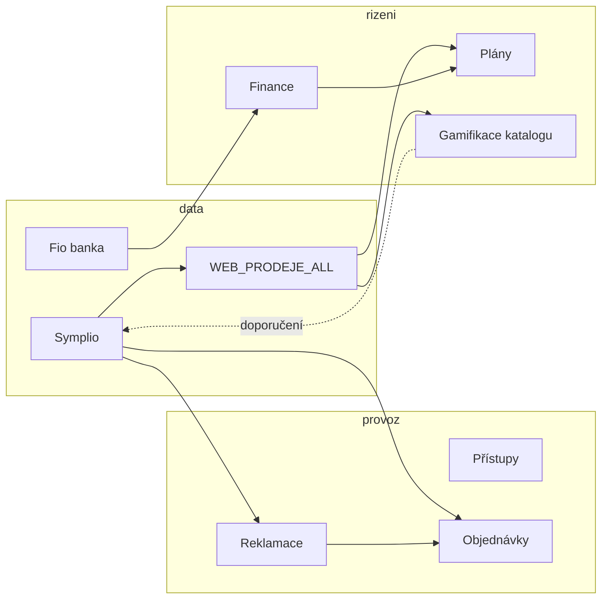

# Roadmap budoucích funkcí MOBILMAJAK

Živý dokument pro plánování rozšíření. U každé oblasti: **stav dnes**, **varianty rozpracování**, **odhad náročnosti** (S/M/L/XL) a **vliv na kvalitu aplikace** (1–5, kde 5 = největší přínos pro provoz nebo řízení firmy).

Poslední revize: 2026-07-02

---

## Jak číst tabulky

| Symbol | Význam |
|--------|--------|
| **S** | řádově dny |
| **M** | 1–2 týdny |
| **L** | 3–6 týdnů |
| **XL** | větší projekt, více modulů / integrací |

**Vliv** = kombinace užitku pro provoz, spolehlivost dat, adopce týmem a snížení ruční práce.

---

## 1. Modul Finance

### Stav dnes

- Backend: `finance` app — modely `NakladPolozka`, `NakladKategorie`, `FioKategorizacniPravidlo`, audit log.
- API: fronta nezařazených, ruční náklad, kategorie; Fio import připraven (`import_fio_naklady`), defaultně **vypnutý** (`FINANCE_FIO_ENABLED=0`).
- Frontend: `FinanceModule` — záložky „K zařazení“ + „Ruční náklad“, za feature flagem.
- Packeta provize: import v analytice (Zásilkovna), ne v modulu Finance.
- Secrets šablona: `secrets/mobilmajak-finance.example.json` (Fio, Packeta admin, Google Sheets náklady).

### Varianty

| Varianta | Popis | Náročnost | Vliv | Poznámka |
|----------|-------|-----------|------|----------|
| **F1 – Minimální produkce** | Zapnout Fio cron + fronta zařazování + pravidla v admin UI | M | 4 | Nejrychlejší ROI; vyžaduje Fio token a `FINANCE_FIO_ENABLED=1` |
| **F2 – Přehled nákladů** | Měsíční/roční dashboard: náklady per kategorie, per prodejna, porovnání s obratem z plánů | L | 5 | Propojí finance s existujícími plány — řízení marže |
| **F3 – Google Sheets sync** | Import/merge z tabulek dle `google_sheets` v secrets (historické náklady) | M | 3 | Jednorázový bootstrap + občasný sync |
| **F4 – Pravidla + auto-zařazení** | UI pro `FioKategorizacniPravidlo`, návrh pravidel z opakovaných zařazení | M | 4 | Stejný pattern jako u katalogové gamifikace (viz §7) |
| **F5 – P&L / cashflow** | Tržby (WEB_PRODEJE_ALL) − náklady − fixní náklady prodejen → jednoduchý výsledek | XL | 5 | Strategické řízení; závisí na kvalitě zařazení (F1–F4) |
| **F6 – Packeta v Finance** | Sjednotit provize Packeta do finance modulu (dnes analytika) | S | 2 | Čistší UX, nižší priorita než Fio |

### Doporučené pořadí

1. **F1** (Fio + fronta)  
2. **F4** (pravidla)  
3. **F2** (přehled)  
4. **F5** až když je zařazení spolehlivé  

### Rizika

- Špatně zařazené náklady = špatná rozhodnutí (F5). Nejdřív kvalita vstupu, pak agregace.
- Fio token na firemním účtu — právní/účetní odsouhlasení.

---

## 2. Import všech hesel (modul Přístupy)

### Stav dnes

- Modul **Přístupy** (`/access`): CRUD přes `web_pristupy` → tabulka `WEB_PRISTUPY_PRODEJNY`.
- Existuje migrační command `migrate_company_access` ze staré tabulky `active_company_access`.
- Hesla v DB jako plaintext (záměr pro rychlé kopírování na prodejně) — zvážit šifrování at-rest v budoucnu.

### Varianty

| Varianta | Popis | Náročnost | Vliv | Poznámka |
|----------|-------|-----------|------|----------|
| **P1 – Jednorázový import** | Spustit `migrate_company_access` na produkci (+ audit duplicit) | S | 4 | Pokud `active_company_access` stále obsahuje kompletní data |
| **P2 – Import z CSV/Excel** | Admin upload: sloupce firma, URL, login, heslo, prodejna, kategorie | S | 3 | Pro data mimo DB (KeePass export, tabulka) |
| **P3 – Sync z externího zdroje** | Pravidelný pull z Google Sheet / 1Password / Bitwarden API | L | 3 | Vyšší údržba; vhodné až po stabilizaci P1/P2 |
| **P4 – Centralizace + šablony** | Globální přístupy (všichni) vs per-prodejna; šablona „nová prodejna“ | M | 4 | Sníží chaos při otevírání poboček |
| **P5 – Audit a expirace** | `last_used`, upozornění na neaktivní / duplicitní účty, rotace hesel | M | 3 | Bezpečnostní hygiena |

### Doporučené pořadí

1. Ověřit obsah `active_company_access` vs `WEB_PRISTUPY_PRODEJNY` → **P1**  
2. Doplnit chybějící z tabulek → **P2**  
3. **P4** pro dlouhodobou správu  

### Otevřené otázky

- Kde dnes „žijí“ hesla, která v aplikaci ještě nejsou? (Symplio admin, dodavatelé, e-shopy, banky…)
- Má být heslo viditelné všem s modulem `access`, nebo jen admin + vedoucí prodejny?

---

## 3. Dokončení modulu Objednávky

### Stav dnes

- Plně funkční kanban (`OrdersModule`): stavy, drag & drop, historie, filtry, dashboard stats.
- Model: zákazník, typ telefonu, díl, barva, dodavatel, servisní číslo — **bez vazby na Symplio objednávku**.
- Backend analytics endpoint existuje (`analytics_data`), frontend ho zatím nevyužívá.

### Co „dokončit“ typicky znamená

| Varianta | Popis | Náročnost | Vliv | Poznámka |
|----------|-------|-----------|------|----------|
| **O1 – Notifikace** | Slack/e-mail při nové objednávce, změně na „dorazilo čeká“, dlouho visící ve stavu | M | 4 | Okamžitý provozní přínos |
| **O2 – Vazba na Symplio** | Pole `symplio_objednavka_id`, odkaz jako v `AuditZbytekPanel` | S | 3 | Konzistence s ostatními moduly |
| **O3 – SLA / eskalace** | Po X dnech ve stavu zvýraznit / eskalovat vedoucímu | M | 4 | Méně „zapomenutých“ dílů |
| **O4 – Admin analytika UI** | Grafy průměrné doby stavů (API už je) | S | 3 | Řízení servisního skladu |
| **O5 – Více dílů na objednávku** | Line items místo jednoho `dil` | M | 3 | Reálnější objednávky |
| **O6 – Dodavatel / objednávkový list** | Export pro MobilPohotovost, BP apod. | M | 4 | Snížení copy-paste |
| **O7 – Mobilní zjednodušený formulář** | Rychlé založení z telefonu na prodejně | M | 4 | Adopce prodejci |
| **O8 – Propojení s reklamacemi** | Objednávka dílu z reklamační evidence (viz §4) | L | 5 | Synergie modulů |

### Doporučené pořadí

**O1 → O2 → O3 → O4** (rychlé wins), pak **O6/O7** dle feedbacku týmu.

---

## 4. Evidence reklamací (díly)

### Stav dnes

- **Výdejky reklamace** se parsují ze Symplia (`sklad_vydejky_parse.py`, subtypy 202/252).
- V mzdách / payroll panelu: souhrn dobropisů + výdejek (ruční / spotřeba / reklamace).
- **Samostatný modul reklamací neexistuje** — žádná evidence stavu dílu, dodavatele, termínu vyřízení.

### Cíl

Evidence reklamací **dílů** (displej, baterie, kryt…): co šlo na reklamační sklad, u koho, v jakém stavu, kdy dorazila náhrada / uzavření.

### Varianty

| Varianta | Popis | Náročnost | Vliv | Poznámka |
|----------|-------|-----------|------|----------|
| **R1 – Import z převodek** | Sync výdejek typu reklamace (S-doklady) → fronta položek k doplnění | M | 5 | Využívá existující parser; minimální ruční zadávání |
| **R2 – Ruční založení** | Formulář: kód dílu, IMEI/servis, dodavatel, důvod, stav | S | 3 | Fallback když import nestačí |
| **R3 – Workflow stavů** | Nová → odesláno → přijato od dodavatele → vydáno zákazníkovi / storno | M | 5 | Kanban podobný objednávkám |
| **R4 – Vazba na objednávky** | Z reklamace jedním klikem založit objednávku chybějícího dílu | M | 4 | Propojení §3 + §4 |
| **R5 – Převodka na reklamační sklad** | Import nejen výdejek, ale i **příjemek / převodek** na reklamační sklad (pokud Symplio exportuje) | L | 4 | Upřesnit dostupný export z Symplia |
| **R6 – Report pro dodavatele** | Měsíční přehled: počet, hodnota, průměrná doba vyřízení | M | 4 | Vyjednávání podmínek |
| **R7 – Fotodokumentace** | Příloha poškození / čísla dílu | M | 3 | Spíš později |

### Navrhovaný datový model (hrubě)

```
ReklamacePolozka
  - kod, nazev, mnozstvi
  - zdroj_doklad (S…), datum_vydeje
  - prodejna_id, zalozil_user_id
  - dodavatel, cislo_reklamace_u_dodavatele
  - stav (enum)
  - symplio_objednavka_id (volitelně)
  - poznamka, uzavreno_datum
```

### Doporučené pořadí

**R1 + R2 + R3** jako MVP, pak **R4**, ověřit **R5** s reálným exportem z Symplia.

### Otevřené otázky

- Vedete reklamace hlavně z **výdejek**, nebo z **objednávek u dodavatele**?
- Má reklamační sklad vlastní skladovou kartu v Symplio, ze které jde číst zůstatek?

---

## 5. Gamifikace znalostí (katalog / kategorie)

> Poznámky z brainstormingu — zatím **neimplementováno**, vhodné jako samostatná fáze po stabilizaci provozních modulů.

### Kontext

- Pracovní Symplio kategorie (`Zakládání`, `Nově naskladněno`, …) → audit Zbytek (`AuditZbytekPanel`).
- Taxonomie v `category_mapping.py`.
- Žebříček bodů (`PointsLeaderboard`) — vzor pro motivaci.

### Varianty

| Varianta | Popis | Náročnost | Vliv | Poznámka |
|----------|-------|-----------|------|----------|
| **G1 – Kvíz** | „Kam patří?“ z historických správně zařazených položek; skóre přesnosti | M | 3 | Bez dopadu na produkci; měří znalosti |
| **G2 – Double-check fronta** | 2 hráči zařadí nezařazenou položku; shoda = doporučení adminovi | L | 4 | Crowdsourcing před Symplio |
| **G3 – Vážené hlasy** | Váha podle kvízové přesnosti v dané podkategorii | M | 3 | Až po G1+G2 |
| **G4 – Žebříček katalogářů** | Týdenní pořadí; body za konsenzus, ne za rychlost | S | 2 | Motivace; pozor na gaming |
| **G5 – Propojení s auditem** | V `AuditZbytekPanel` badge: doporučeno / spor / hotovo | M | 4 | Admin vidí výsledek hry |

### Doporučené pořadí

**G1** (ověření zájmu) → **G2 + G5** → **G3/G4**.

### Principy

- Hra **nedělá zápis do Symplio** — jen doporučení a metriky.
- Kvízové „správné“ odpovědi jen z položek stabilně mimo pracovní kategorie.
- Body za shodu dvou nezávislých hráčů.

---

## 6. Další rozšíření (návrhy)

| Nápad | Popis | Náročnost | Vliv | Priorita |
|-------|-------|-----------|------|----------|
| **Řízení marže po prodejně** | Obrat − náklady (finance) − mzdy (shifts) per prodejna | XL | 5 | Po F2/F5 |
| **Alerting / digest** | Denní Slack report prodejů (DM, opt-in v profilu) – viz §11 | M | 4 | **Částečně hotovo** (2026-06-30) |
| **Skladové minimum** | Watchdog na často objednávané díly dle historie objednávek | L | 4 | Prevence výpadků |
| **Zákaznická fronta servisu** | Jednoduchá fronta „čeká na opravu“ napojená na servisní čísla | L | 3 | Lepší komunikace se zákazníkem |
| **Školení / onboarding** | Checklist nováčka + kvíz (může sdílet G1) | M | 3 | Nižší chybovost juniorů |
| **Katalog dodavatelů** | Ceníky, kontakty, SLA — navázat na Přístupy | M | 3 | Podpora nákupu |
| **Centrální audit log** | Kdo změnil co (finance, objednávky, přístupy) na jednom místě | M | 3 | Dozor a debugging |
| **Rozšíření camera gateway** | Jednotný dashboard stavu kamer všech prodejen | M | 3 | Provozní bezpečnost |
| **Predikce plnění** | Rozšířit `forecast.py` o varování „nepoženete plán“ v polovině měsíce | M | 4 | Využívá existující plány |
| **Interní knowledge base** | Krátké návody (jak založit reklamaci, jak objednat díl) v aplikaci | S | 3 | Méně opakovaných dotazů |
| **Mobilní PWA režim** | Offline-light pro objednávky a přístupy na prodejně | L | 4 | Adopce v terénu |
| **Symplio kategorie webhook** | Po ruční změně v Symplio označit položku v G2 jako vyřešenou | XL | 3 | Závislost na Symplio API |
| **Novinky – kdo reagoval** | V UI u příspěvku zobrazit, kdo dal kterou emoji reakci (data už jsou v API) | S | 3 | Viz §12 |
| **Audit komentářů pro ne-adminy** | Ověřit a otestovat, že komentovat mohou i běžní uživatelé (novinky + úkoly) | S | 4 | Viz §12 |

---

## 7. Souhrnná prioritizace (doporučení)

### Vlna 1 — rychlé provozní wins (1–2 měsíce)

| # | Položka | Proč |
|---|---------|------|
| 1 | Finance F1 (Fio + fronta) | Datový základ pro řízení nákladů |
| 2 | Přístupy P1/P2 (import hesel) | Okamžitě užitečné na prodejnách |
| 3 | Objednávky O1, O2, O3 | Méně ztracených dílů |
| 4 | Alerting digest | Levné, viditelné |

### Vlna 2 — propojení modulů (2–4 měsíce)

| # | Položka | Proč |
|---|---------|------|
| 5 | Reklamace R1–R3 | Zaplní díru mezi výdejkami a realitou servisu |
| 6 | Finance F2 + F4 | Přehled a méně ručního zařazení |
| 7 | Objednávky O4, O6 + Reklamace R4 | Jednotný tok dílů |

### Vlva 3 — strategie a kultura (dlouhodobě)

| # | Položka | Proč |
|---|---------|------|
| 8 | Finance F5 (P&L) | Až když jsou data čistá |
| 9 | Gamifikace G1–G2 | Zlepšení kvality katalogu |
| 10 | Marže per prodejna | Vedení firmy |

---

## 8. Závislosti mezi moduly



---

## 9. Checklist před zahájením každé vlny

- [ ] Krátký feedback od 2–3 uživatelů z prodejny + 1 admin
- [ ] Definovat „hotovo“ pro MVP (ne všechny varianty najednou)
- [ ] Lokální test (`mobilmajak-local-test` skill) + staging deploy
- [ ] Dokumentace v `docs/` jen pro netriviální integrace (Symplio, Fio)

---

## 11. Slack denní report prodejů

### Stav dnes (2026-06-30)

- Command `send_daily_slack_report` – DM přes `SLACK_BOT_TOKEN`, cron **20:30** denně na produkci.
- Výchozí příjemci: **Radek Bulandra**, **Petr Valenta** (zapnuto v migraci).
- V **Můj profil → Slack** lze vypnout/zapnout „Zasílat denní report“ (`WebUser.slack_daily_report`).
- Obsah: celkový obrat/zisk, prodejny, top 3 prodejci za **předchozí kalendářní den**.

### Plánované rozšíření (personalizace)

| Varianta | Popis | Náročnost | Vliv |
|----------|-------|-----------|------|
| **D1 – Report pro prodejce** | Jen vlastní prodejna + vlastní metriky (položky, body, servis) | M | 4 |
| **D2 – Výběr sekcí** | Checkboxy: celá firma / jen moje prodejna / e-shop / servis | M | 3 |
| **D3 – Vedoucí přehled** | Pro VEDOUCI: srovnání prodejen v týmu | M | 4 |
| **D4 – Kanálový digest** | Volitelný webhook do `#management` místo/vedle DM | S | 2 |
| **D5 – MTD řádek** | „Od začátku měsíce“ v každém reportu | S | 3 |

### Doporučené pořadí

**D5** (rychlé) → **D1** (největší užitek pro prodejce) → **D2/D3**.

---

## 12. Novinky – reakce a komentáře

### Stav dnes

- **Reakce:** model `Reakce`, API vrací `reakce[]` včetně `uzivatel` (`ReakceSerializer`). Frontend (`Post.js`) zobrazuje jen souhrnný počet a počty per emoji – **ne kdo konkrétně reagoval**.
- **Komentáře k novinkám:** backend `IsAuthenticated` – komentovat může každý přihlášený uživatel; mazat jen autor nebo admin.
- **Komentáře k úkolům:** backend vyžaduje `user_can_access_task` (admin, vedoucí prodejny, přiřazený řešitel, osobní úkol). Frontend formulář neomezuje podle role, ale při chybě 403 se chyba **neukáže** (`TaskComments.js` – tiché selhání).

### Plánované rozšíření

| Varianta | Popis | Náročnost | Vliv |
|----------|-------|-----------|------|
| **N1 – Kdo reagoval** | Po kliknutí / hover na emoji badge: popover se seznamem jmen (seskupení per typ reakce) | S | 3 |
| **N2 – Audit komentářů ne-adminů** | E2E ověření: prodejce komentuje novinku; řešitel / vedoucí komentuje úkol, ke kterému má přístup; dokumentovat očekávané chování | S | 4 |
| **N3 – Testy oprávnění** | Backend testy: `POST /news/{id}/komentare/` a `POST /tasks/{id}/comments/` pro role PRODEJCE, VEDOUCI, ADMIN | S | 4 |
| **N4 – Viditelná chyba u úkolů** | Místo tichého failu zobrazit „Nemáte oprávnění“ nebo API message | S | 3 |

### Kontrolní checklist (N2)

- [ ] Prodejce (ne admin) přidá komentář k novince – úspěch
- [ ] Přiřazený řešitel přidá komentář ke svému úkolu – úspěch
- [ ] Vedoucí přidá komentář k úkolu na své prodejně – úspěch
- [ ] Uživatel bez přístupu k úkolu dostane 403 a srozumitelnou hlášku (po N4)
- [ ] Reakce: po implementaci N1 jsou jména reagujících čitelná u každého příspěvku

### Doporučené pořadí

**N2 + N3** (ověření oprávnění) → **N4** (UX) → **N1** (reakce).

---

## 13. Zásilkovna – konverze a ruční opravy

### Stav dnes (2026-07-02)

- Modul **Zásilkovna konverze** propojuje prodeje s Packeta provizemi (`finance_packeta_provize`).
- Označení Z čte z **`Poznamka_dokladu`** (poznámka k účtence v Sympliu), dále `Poznamka` u položky a `Poznamka_zakaznika`.
- Podporuje **samotné „Z“** (bez čísla balíku) i **Z + číslo zásilky**.
- Fallback: sleva `ZASILKOVNA` na účtence, když chybí poznámka Z.
- Sloupec `Poznamka_dokladu` byl vrácen do `WEB_PRODEJE_ALL` (migrace `0020`) – **Symplio actor musí pole znovu plnit** při importu.
- Packeta detailní import běží cronem 3× denně; při výpadku chybí návštěvy balíků v konverzi (měsíční `WEB_ZASILKOVNA` může být aktuálnější).

### Plánované rozšíření

| Varianta | Popis | Náročnost | Vliv |
|----------|-------|-----------|------|
| **Z1 – Audit chybějících Z** | Fronta dokladů: sleva Zásilkovna bez poznámky Z, Z bez propojení na Packeta, neplatné číslo balíku | M | 5 |
| **Z2 – Ruční přiřazení v UI** | Admin/vedoucí: k dokladu doplnit Z / číslo balíku, přiřadit k Packeta návštěvě, označit jako vyřešeno | M | 5 |
| **Z3 – Oprava po importu** | Uložené ruční opravy přežijí další Symplio re-import (override tabulka nebo merge pravidlo) | L | 4 |
| **Z4 – Notifikace prodejci** | Slack / úkol: „chybí Z u účtenky se slevou Zásilkovna“ do konce směny | M | 4 |
| **Z5 – Sjednocení Packeta zdrojů** | Jeden zdroj pravdy: detailní provize + měsíční souhrn; alert při výpadku cronu | S | 4 |

### Kontrolní checklist (Z1)

- [ ] Doklad se slevou Zásilkovna a bez poznámky Z → ve frontě auditu
- [ ] Doklad s poznámkou Z bez shody v Packeta → ve frontě (čeká import nebo ruční párování)
- [ ] Po Z2 ruční opravě se metriky konverze přepočítají bez redeploye

### Doporučené pořadí

**Z1** (audit) → **Z2** (ruční UI) → **Z5** (spolehlivý import) → **Z3** (perzistence oprav) → **Z4** (notifikace).

---

## 10. Historie změn dokumentu

| Datum | Změna |
|-------|-------|
| 2026-07-02 | §13 Zásilkovna – audit a ruční opravy konverze |
| 2026-07-01 | §12 Novinky – kdo reagoval + audit komentářů pro ne-adminy |
| 2026-06-30 | §11 Slack denní report + personalizace do budoucna |
| 2026-06-29 | První verze: finance, přístupy, objednávky, reklamace, gamifikace, návrhy rozšíření |
