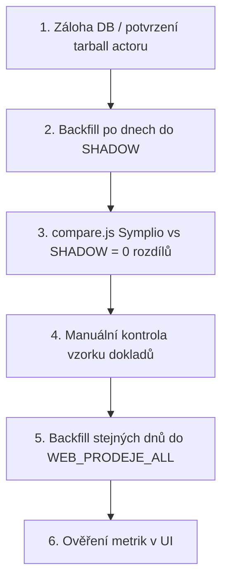

# Symplio → MOBILMAJAK: problém s počtem položek, řešení a oprava historie

> Export kontextu pro pokračování v jiném chatu (květen 2026).

---

## 1. Problém (symptom)

Když se na **jedné účtence** prodá **více stejných položek** (stejný kód, často stejný čas), v **Symplio** je každý řádek zvlášť (`Počet kusů = 1` na řádek). V **MySQL** `WEB_PRODEJE_ALL` zůstane často **jen jeden řádek** na kombinaci doklad + kód.

**Příklad – doklad `32604219001` (21. 4. 2026):**

| Zdroj | Řádků celkem | LOS | P141931 |
|--------|--------------|-----|---------|
| Symplio (export) | 9 | 4× | 4× (1× 499 Kč + 3× 249 Kč) |
| Produkce `WEB_PRODEJE_ALL` (před opravou) | 4 | 1× | 1× |
| Shadow `WEB_PRODEJE_ALL_SHADOW` (po opravě) | 9 | 4× | 4× |

**Dopad na metriky (vše čte stejnou tabulku):**

| Metrika | Dopad |
|---------|--------|
| Položky nad 100 Kč | `Sum(pocet_kusu)` – **podúčet** |
| Služby celkem | `Count(id)` řádků – **podúčet** |
| Průměr pol./účtu | `Count(řádků ≥29) / počet dokladů` – **čitatel níž**, jmenovatel OK |
| Celková čísla (obrat, kusy, zisk) | `Sum(pocet_kusu × cena)` – **podúčet**; počet dokladů obvykle OK |
| Body / provize produktů | podúčet kusů a služeb |
| Servisní provize (10 % marže) | stejná logika na řádcích servisu |
| Zásilkovna provize | **bez vlivu** (`WEB_ZASILKOVNA`) |

**Není to „ignorování celé účtenky“** – první řádek dané skupiny se uloží, další se zahodí.

---

## 2. Příčina (kde je chyba)

- **Zápis do DB nedělá Django** – pouze čte `WEB_PRODEJE_ALL`.
- Zápis dělá **externí actor** na VPS:  
  `/opt/actor/ACTOR_FINALL_WEB_PRODEJE_ALL/main.js`  
  Cron: `*/2 * * * * /opt/run-prodeje-actor-safe.sh`

**Původní logika v `insertDataToWebProdejeAll`:**

```text
dupKey = Vystaveno | cas_prodeje | Kód | Doklad
```

- Při importu: pokud `dupKey` už je v DB nebo v aktuálním běhu → řádek **přeskočit** (`skippedCount`).
- Ve schematu actoru byl i `UNIQUE (Vystaveno, Kod, Doklad)` – v **živé produkční tabulce** tento index **není**; kolaps dělá hlavně aplikační `existingSet`.

**Actor stahuje ze Symplia jen dnešní den** (`dateFrom` = `dateTo` = today). Historická data se samy neopraví.

**Compare duben 2026 (před opravou):**

| | Hodnota |
|--|---------|
| Řádků Symplio | 5794 |
| Řádků DB | 5600 |
| Chybějících řádků | **194** (= simulace `would_skip`) |
| Párů (Doklad, Kód) s více řádky v DB | **0** (všechno zkolabované na 1) |

---

## 3. Současné řešení (implementované)

### 3.1 Nový klíč řádku

```text
lineKey = Vystaveno | cas | Kód | Doklad | Cena_ks_vcl_DPH | pořadí_řádku_na_dokladu
```

`pořadí_řádku_na_dokladu` = pořadové číslo řádku v rámci daného dokladu v exportu (1, 2, 3…).

### 3.2 Idempotentní import dne

Pro všechny dny v aktuálním exportu:

1. `DELETE FROM {TABLE} WHERE Vystaveno IN (tyto dny)`
2. `INSERT` všech řádků z XLSX (bez starého dupKey skipu vůči DB)

### 3.3 Soubory

| Soubor | Účel |
|--------|------|
| [`actors_backup/main.js`](../actors_backup/main.js) | Opravený produkční import |
| [`actors_backup/import-shadow.js`](../actors_backup/import-shadow.js) | Test zápisu do shadow |
| [`actors_backup/compare.js`](../actors_backup/compare.js) | Diff Symplio XLSX vs DB (`PRODEJE_TABLE` env) |
| [`actors_backup/README.md`](../actors_backup/README.md) | Zálohy, rollback |
| [`scripts/backup-actor-vps.ps1`](../scripts/backup-actor-vps.ps1) | Tarball záloha actoru |
| [`scripts/compare-symplio-month.ps1`](../scripts/compare-symplio-month.ps1) | Spuštění compare na VPS |

### 3.4 Shadow test (ověřeno 21. 4. 2026)

- Tabulka: `WEB_PRODEJE_ALL_SHADOW` (`CREATE TABLE … LIKE WEB_PRODEJE_ALL`)
- Import z `reports/symplio_2026-04-21_2026-04-21.xlsx`
- Výsledek: **298 = 298** řádků, **0** nesouladů `(Doklad, Kód)`

---

## 4. Zálohy (rollback)

| Záloha | Cesta |
|--------|--------|
| Tarball VPS | `/opt/backups/actor-ACTOR_FINALL_WEB_PRODEJE_ALL-20260521-124249.tar.gz` |
| Lokální tarball | `actors_backup/actor-ACTOR_FINALL_WEB_PRODEJE_ALL-20260521-124249.tar.gz` |
| main.js před fix | VPS: `main.js.bak-before-linekey-fix` |

**Rollback produkčního actoru:**

```bash
cp /opt/actor/ACTOR_FINALL_WEB_PRODEJE_ALL/main.js.bak-before-linekey-fix \
   /opt/actor/ACTOR_FINALL_WEB_PRODEJE_ALL/main.js
```

---

## 5. Odpověď: zapisuje upravený actor už do produkce?

### Ano – od nasazení opravy zapisuje do produkce `WEB_PRODEJE_ALL`

Ověřeno na VPS (21. 5. 2026):

- V `/opt/actor/ACTOR_FINALL_WEB_PRODEJE_ALL/main.js` jsou funkce `buildLineImportKey`, `getProdejeTableName`, `DELETE FROM ${TABLE} WHERE Vystaveno IN (...)`.
- Výchozí tabulka: `process.env.PRODEJE_TABLE || 'WEB_PRODEJE_ALL'` → **produkce**, ne shadow.
- Cron: `*/2 * * * * /opt/run-prodeje-actor-safe.sh` – běží dál.

**Co to prakticky znamená:**

| Období | Chování |
|--------|---------|
| **Dnešní den (každé ~2 min)** | Actor stáhne Symplio export **jen pro dnešek**, smaže řádky s `Vystaveno = dnes` v `WEB_PRODEJE_ALL`, vloží všechny řádky s novým klíčem. **Nové zápisy jdou do produkce.** |
| **Včerejšek a starší data v produkci** | **Neopravena automaticky.** Zůstávají chybně (chybí řádky). |
| **Shadow tabulka** | Pouze ruční test (`import-shadow.js`). Cron do ní **nezapisuje**. |

**Shrnutí jednou větou:** Upravený actor **ano, zapisuje do produkční tabulky**, ale **pouze pro dny, které stáhne** – tedy aktuálně prakticky **od dnešního dne opakovaně** (dnešek se při každém běhu přepíše správně). Historie se sama nezmění.

---

## 6. Jak opravit historická data

### Provedeno 2026-05-21 (produkce)

| Období | Před | Po | compare |
|--------|------|-----|---------|
| Duben 2026 | 5600 | **5794** | symplio=db, mismatches=0 |
| Květen 1.–20. 2026 | 3429 | **3572** | symplio=db, mismatches=0 |

Skript na VPS: `backfill-historical.js`, orchestrace: `run-backfill-remote.sh`. Dnešek řeší cron.

**Backfill historie (2026-05-21):** na VPS běží `node backfill-months.js 2024-01 2026-03` (leden 2024 → březen 2026; duben/květen už hotové). Log: `reports/backfill_2024-01_2026-03.log`, PID: `reports/backfill-pre-april.pid`. Po dokončení se cron automaticky zapne.

### Doporučený postup (bezpečný)



### 6.1 Backfill jednoho dne (vzor)

Na VPS, s existujícím XLSX z compare nebo novým stažením:

```bash
cd /opt/actor/ACTOR_FINALL_WEB_PRODEJE_ALL
export DB_HOST=... DB_USER=... DB_PASSWORD=... DB_NAME=...

# Test do shadow (bezpečné)
export PRODEJE_TABLE=WEB_PRODEJE_ALL_SHADOW
node import-shadow.js --file reports/symplio_2026-04-21_2026-04-21.xlsx

# Kontrola
PRODEJE_TABLE=WEB_PRODEJE_ALL_SHADOW node compare.js \
  --file reports/symplio_2026-04-21_2026-04-21.xlsx \
  --from 2026-04-21 --to 2026-04-21 --out ./reports/shadow-verify
# očekávání: symplio == db, doklad_kod_mismatches == 0
```

### 6.2 Backfill celého měsíce (duben 2026)

1. Stáhnout export za `2026-04-01` až `2026-04-30` (compare.js `--download` už umí Chrome download).
2. **Nejdřív shadow:**

```bash
export PRODEJE_TABLE=WEB_PRODEJE_ALL_SHADOW
node import-shadow.js --file reports/symplio_2026-04-01_2026-04-30.xlsx
PRODEJE_TABLE=WEB_PRODEJE_ALL_SHADOW node compare.js \
  --from 2026-04-01 --to 2026-04-30 --download  # nebo --file pokud už staženo
```

3. Po `doklad_kod_mismatches ≈ 0` → **produkce po dnech** (nižší riziko):

```bash
# bez PRODEJE_TABLE → WEB_PRODEJE_ALL
# Rozdělit po týdnech nebo dnech – každý import dělá DELETE jen pro dny v souboru
node import-shadow.js --file symplio_den_2026-04-21.xlsx  # upravit import-shadow pro produkci
# nebo rozšířit skript: --target production
```

**Pozor:** `import-shadow.js` dnes cílí na shadow; pro produkční backfill použijte stejnou logiku s `PRODEJE_TABLE=WEB_PRODEJE_ALL` nebo dočasně upravte `import-shadow.js` / spusťte opravený `main.js` v režimu „jen stažení + insert“ bez Selenium loop.

**Jednodušší varianta pro produkci:** pro každý den dubna:

- `compare.js --download --from YYYY-MM-DD --to YYYY-MM-DD` → XLSX
- skript s `PRODEJE_TABLE=WEB_PRODEJE_ALL` + `import-shadow.js` logika → DELETE den + INSERT

Očekávaný efekt pro duben: **+194 řádků** oproti současné produkci (5794 vs 5600).

### 6.3 Django

**Změna v Django není nutná** pro opravu dat – stačí opravit data v DB. Volitelně později sjednotit `prumer_polozek` na `Sum(pocet_kusu)` místo `Count(id)` v [`backend/analytics/views.py`](../backend/analytics/views.py) (`_aggregate_web_prodeje_all_salesperson`).

---

## 7. Diagnostické SQL

```sql
-- Kolaps na dokladu
SELECT Doklad, Kod, COUNT(*) radku, SUM(Pocet_kusu) kusy
FROM WEB_PRODEJE_ALL
WHERE Doklad = '32604219001'
GROUP BY Doklad, Kod;

-- Kolik párů má jen 1 řádek za měsíc (podezřelé)
SELECT COUNT(*) FROM (
  SELECT Doklad, Kod FROM WEB_PRODEJE_ALL
  WHERE Vystaveno >= '2026-04-01' AND Vystaveno < '2026-05-01'
    AND Kod IS NOT NULL AND Kod != ''
  GROUP BY Doklad, Kod HAVING COUNT(*) = 1
) t;
```

---

## 8. Rizika a poznámky

- **Staging aplikace ≠ izolovaná DB** – stejný MySQL jako produkce. Shadow tabulka je bezpečná pro test zápisu.
- **DELETE + INSERT pro den** při cronu: krátký okamžik, kdy jsou dnešní data přepsaná; metriky pro dnešek mohou krátce „bliknout“.
- **Nepouštět compare v cronu** – jen ručně; compare stahuje velké exporty.
- **Credentials** v `main.js` na VPS – není v gitu (`actors_backup/` v `.gitignore`).

---

## 9. Kontrolní checklist po backfillu historie

- [ ] `compare` za měsíc: `symplio_row_count` ≈ `db_row_count`, `doklad_kod_mismatches` = 0
- [ ] Doklad `32604219001`: LOS 4, P141931 4
- [ ] Profil prodejce: „Položky nad 100 Kč“ a průměr odpovídají Symplio za den
- [ ] Celková čísla: obrat/kusy za duben vzrostou odpovídajícím způsobem
- [ ] Actor cron běží, v logu není masivní `skippedCount` se starým dupKey (už nemá existovat)

---

## 10. Rychlé odkazy v repozitáři

- Dashboard metriky: [`frontend/src/modules/profile/ProfileAnalytics.js`](../frontend/src/modules/profile/ProfileAnalytics.js)
- Agregace prodejce: [`backend/analytics/views.py`](../backend/analytics/views.py) → `_aggregate_web_prodeje_all_salesperson`
- Celková čísla: `celkova_cisla_view` → `Sum(pocet_kusu)`, `Count(doklad distinct)`
- API config: [`frontend/src/config/apiConfig.js`](../frontend/src/config/apiConfig.js) → `WEB_PRODEJE`

---

*Dokument vygenerován po implementaci opravy (květen 2026).*
